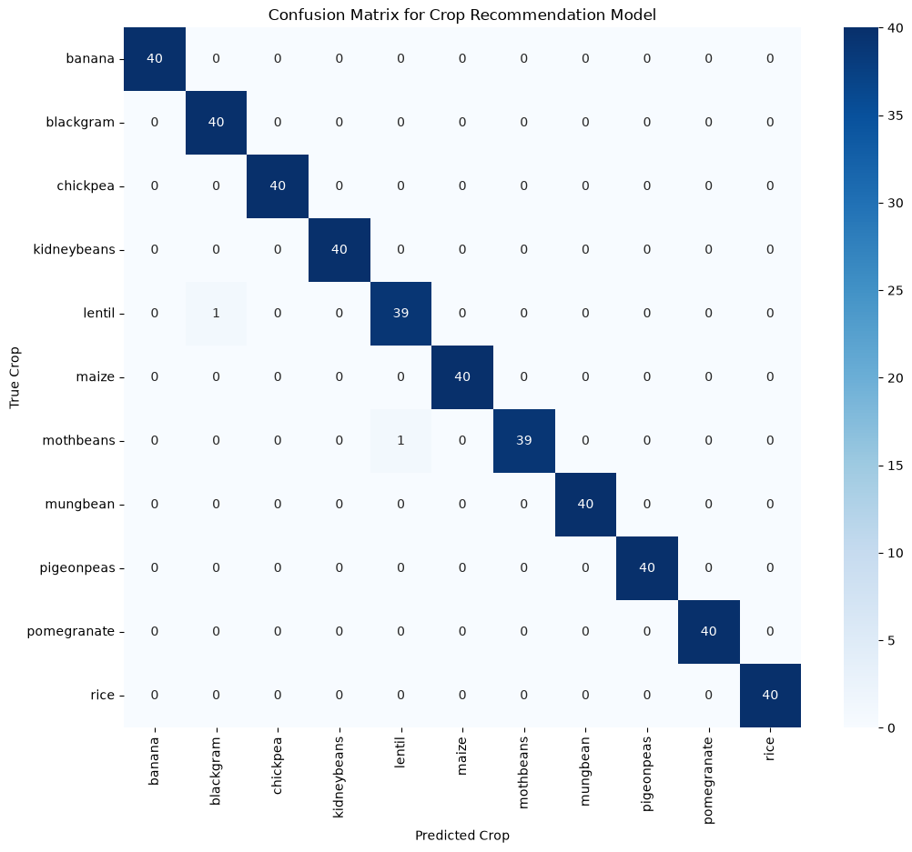
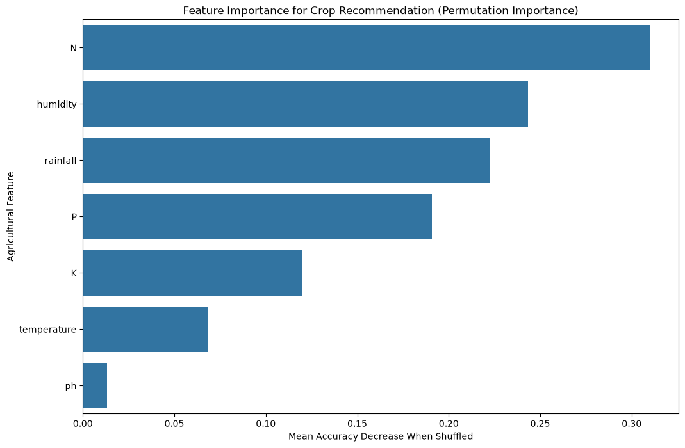

# AI-Based Crop Recommendation System

A data science project to recommend the optimal crop for a given set of soil and weather conditions, inspired by a problem statement from the Smart India Hackathon (SIH).

## Project Vision

This project addresses the Smart India Hackathon problem statement SIH25030: "AI-Based Crop Recommendation for Farmers." By providing data-driven advice, it aims to help farmers increase yield, improve profitability, and support national food security.

The main objective is to develop a machine learning model that analyzes key agricultural parameters—such as soil nutrient levels, temperature, humidity, and rainfall—to classify and recommend the most suitable crop. This serves as a proof-of-concept for a real-world agricultural advisory tool.

## Core Features

- **Realistic Synthetic Data:** Custom-generated dataset simulating real-world soil and climate data for various crops.
- **Predictive Modeling:** Classification model recommends the best crop based on input data.
- **Feature Importance Analysis:** Highlights the most significant environmental factors for crop prediction.
- **Clear Visualizations:** Presents model performance using confusion matrices and other relevant plots.

## Technology Stack

- **Language:** Python 3
- **Data Science & ML:** pandas, scikit-learn, numpy
- **Data Visualization:** matplotlib, seaborn
- **Development Environment:** Jupyter Notebooks (recommended), Python scripts

## Project Structure

The analysis is organized into four sequential Jupyter Notebooks:

1. **notebooks/01_data_generation.ipynb:** Creates and explores the synthetic dataset of agricultural conditions and optimal crops.
2. **notebooks/02_data_preprocessing.ipynb:** Cleans, encodes, and prepares the data for machine learning.
3. **notebooks/03_model_development.ipynb:** Trains and evaluates several classification models to identify the best performer.
4. **notebooks/04_results_visualization.ipynb:** Visualizes results, including model accuracy for each crop and key predictive factors.

Other files:
- **models/best_model_crop.pkl:** Saved best-performing model for crop recommendation.

## Setup Instructions

### 1. Create Python Environment (Recommended)

It is recommended to use a virtual environment to avoid dependency conflicts:

```bash
python3 -m venv venv
source venv/bin/activate
```

### 2. Install Dependencies

Install required libraries:

```bash
pip install -r requirements.txt
```

### 3. Run the Project

Open the notebooks in the `notebooks/` folder using JupyterLab or Jupyter Notebook:

```bash
jupyter lab
# or
jupyter notebook
```

Run the notebooks in order (01 → 04) for full workflow.

## Testing & Verification

Ran the full pipeline end to end (`01` → `04`, via `jupyter nbconvert
--execute`) rather than just reading the notebooks. Confirmed:

- Logistic Regression, Random Forest, and SVM all train and evaluate
  correctly; SVM is selected as the best model (99.55% test accuracy)
  and saved to `models/best_model_crop.pkl`.
- Found and fixed a real gap in `04_results_visualization.ipynb`: the
  "Feature Importance Analysis" plot only worked when the best model
  happened to be a Random Forest (`if 'RandomForestClassifier' in
  str(...)`) — since the actual best model is an SVM, running the
  notebook as committed silently skipped the plot and printed a
  fallback message instead, despite this being one of the README's
  advertised Core Features. Fixed by switching to
  `sklearn.inspection.permutation_importance`, which works for any
  model type, and re-verified the plot now renders correctly regardless
  of which model wins:

  
  

## Known Limitations

- **The near-perfect accuracy (99%+) reflects the synthetic dataset's
  clean separability, not real-world difficulty.** Each crop's 7
  features are drawn from independent Gaussian distributions centered
  on fixed "ideal" values with small standard deviations, so classes
  end up close to linearly separable. Real soil/weather sensor readings
  would have far more noise and overlap between crops with similar
  requirements — treat this as a proof-of-concept for the pipeline
  shape, not a validated real-world accuracy figure.
- No automated test suite — verification here was running the actual
  notebooks end to end, not a committed `tests/` directory.

## License

MIT — see [LICENSE](LICENSE).
